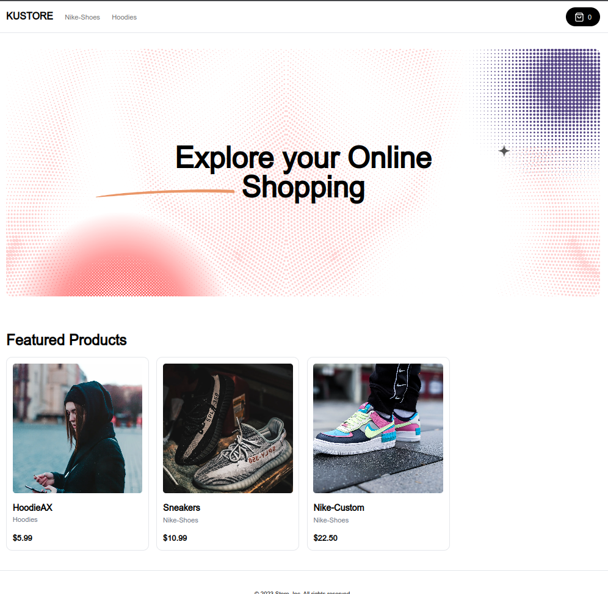

# Full Stack E-Commerce + Store  & CMS: Next.js 13 App Router, React, Tailwind, Prisma, MySQL, 2023

### Front-end Store


For DEMO, use [Stripe Testing Cards](https://stripe.com/docs/testing)

This is a repository for a Full Stack E-Commerce + Dashboard & CMS: Next.js 13 App Router, React, Tailwind, Prisma, MySQL


Key Features:

- We will be using Shadcn UI for the Admin!
- Our admin dashboard is going to serve as both CMS, Admin and API!
- You will be able to control mulitple vendors / stores through this single CMS! (For example you can have a "Shoe store" and a "Laptop store" and a "Suit store", and our CMS will generate API routes for all of those individually!)
- You will be able to create, update and delete categories!
- You will be able to create, update and delete products!
- You will be able to upload multiple images for products, and change them whenever you want!
- You will be able to create, update and delete filters such as "Color" and "Size", and then match them in the "Product" creation form.
- You will be able to create, update and delete "Billboards" which are these big texts on top of the page. You will be able to attach them to a single category, or use them standalone (Our Admin generates API for all of those cases!)
- You will be able to Search through all categories, products, sizes, colors, billboards with included pagination!
- You will be able to control which products are "featured" so they show on the homepage!
- You will be able to see your orders, sales, etc.
- You will be able to see graphs of your revenue etc.
- You will learn Clerk Authentication!
- Order creation
- Stripe checkout
- Stripe webhooks
- MySQL + Prisma + PlanetScale

### Prerequisites

### **Node version 14.x**


# Getting Started
First, run the development server:
```
npm run dev
```
```
yarn dev
```
```
pnpm dev
```
```
bun dev
```
Open http://localhost:3000 with your browser to see the result.

You can start editing the page by modifying app/page.tsx. The page auto-updates as you edit the file.

This project uses next/font to automatically optimize and load Inter, a custom Google Font.

# Learn More
To learn more about Next.js, take a look at the following resources:

Next.js Documentation - learn about Next.js features and API.
Learn Next.js - an interactive Next.js tutorial.
You can check out the Next.js GitHub repository - your feedback and contributions are welcome!

# Deploy on Vercel
The easiest way to deploy your Next.js app is to use the Vercel Platform from the creators of Next.js.

Check out our Next.js deployment documentation for more details.

###Next.js
# Install and configure Next.js.
# Create Project
Start by creating a new Next.js project using create-next-app:
npx create-next-app@latest my-app --typescript --tailwind --eslint
Create shadcn-ui init command to setup your project:
```
npx shadcn-ui@latest init
```
### Install packages

```shell
npm i
```

### Setup .env file

```shell
NEXT_PUBLIC_API_URL=
```


### Start the app

```shell
npm run dev
```

